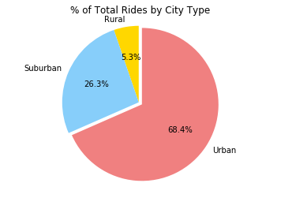
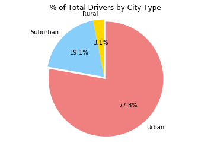

```python
import pandas as pd
import numpy as np
import matplotlib.pyplot as plt
```


```python
ride_file="./raw_data/ride_data.csv"
city_file="./raw_data/city_data.csv"
```


```python
ride_df = pd.read_csv(ride_file)
ride_df.head()
```


<div>
<table border="1" class="dataframe">
  <thead>
    <tr style="text-align: right;">
      <th></th>
      <th>city</th>
      <th>date</th>
      <th>fare</th>
      <th>ride_id</th>
    </tr>
  </thead>
  <tbody>
    <tr>
      <th>0</th>
      <td>Sarabury</td>
      <td>2016-01-16 13:49:27</td>
      <td>38.35</td>
      <td>5403689035038</td>
    </tr>
    <tr>
      <th>1</th>
      <td>South Roy</td>
      <td>2016-01-02 18:42:34</td>
      <td>17.49</td>
      <td>4036272335942</td>
    </tr>
    <tr>
      <th>2</th>
      <td>Wiseborough</td>
      <td>2016-01-21 17:35:29</td>
      <td>44.18</td>
      <td>3645042422587</td>
    </tr>
    <tr>
      <th>3</th>
      <td>Spencertown</td>
      <td>2016-07-31 14:53:22</td>
      <td>6.87</td>
      <td>2242596575892</td>
    </tr>
    <tr>
      <th>4</th>
      <td>Nguyenbury</td>
      <td>2016-07-09 04:42:44</td>
      <td>6.28</td>
      <td>1543057793673</td>
    </tr>
  </tbody>
</table>
</div>


```python
city_df = pd.read_csv(city_file)
city_df.head()
```


<div>
<table border="1" class="dataframe">
  <thead>
    <tr style="text-align: right;">
      <th></th>
      <th>city</th>
      <th>driver_count</th>
      <th>type</th>
    </tr>
  </thead>
  <tbody>
    <tr>
      <th>0</th>
      <td>Kelseyland</td>
      <td>63</td>
      <td>Urban</td>
    </tr>
    <tr>
      <th>1</th>
      <td>Nguyenbury</td>
      <td>8</td>
      <td>Urban</td>
    </tr>
    <tr>
      <th>2</th>
      <td>East Douglas</td>
      <td>12</td>
      <td>Urban</td>
    </tr>
    <tr>
      <th>3</th>
      <td>West Dawnfurt</td>
      <td>34</td>
      <td>Urban</td>
    </tr>
    <tr>
      <th>4</th>
      <td>Rodriguezburgh</td>
      <td>52</td>
      <td>Urban</td>
    </tr>
  </tbody>
</table>
</div>


```python
ride_sum = pd.DataFrame({
    "tot_fare": ride_df.groupby("city")["fare"].sum(),
    "avg_fare":  ride_df.groupby("city")["fare"].mean(), 
    "ride_count": ride_df.groupby("city")["ride_id"].count()})
ride_sum.reset_index(inplace=True)
ride_sum.head()
#len(ride_sum)
```


<div>
<table border="1" class="dataframe">
  <thead>
    <tr style="text-align: right;">
      <th></th>
      <th>city</th>
      <th>avg_fare</th>
      <th>ride_count</th>
      <th>tot_fare</th>
    </tr>
  </thead>
  <tbody>
    <tr>
      <th>0</th>
      <td>Alvarezhaven</td>
      <td>23.928710</td>
      <td>31</td>
      <td>741.79</td>
    </tr>
    <tr>
      <th>1</th>
      <td>Alyssaberg</td>
      <td>20.609615</td>
      <td>26</td>
      <td>535.85</td>
    </tr>
    <tr>
      <th>2</th>
      <td>Anitamouth</td>
      <td>37.315556</td>
      <td>9</td>
      <td>335.84</td>
    </tr>
    <tr>
      <th>3</th>
      <td>Antoniomouth</td>
      <td>23.625000</td>
      <td>22</td>
      <td>519.75</td>
    </tr>
    <tr>
      <th>4</th>
      <td>Aprilchester</td>
      <td>21.981579</td>
      <td>19</td>
      <td>417.65</td>
    </tr>
  </tbody>
</table>
</div>


```python
city_sum = city_df.groupby(["city"],as_index=False).agg({"driver_count":"sum","type":"min"})
city_sum.head()
#len(city_sum)
```


<div>
<table border="1" class="dataframe">
  <thead>
    <tr style="text-align: right;">
      <th></th>
      <th>city</th>
      <th>driver_count</th>
      <th>type</th>
    </tr>
  </thead>
  <tbody>
    <tr>
      <th>0</th>
      <td>Alvarezhaven</td>
      <td>21</td>
      <td>Urban</td>
    </tr>
    <tr>
      <th>1</th>
      <td>Alyssaberg</td>
      <td>67</td>
      <td>Urban</td>
    </tr>
    <tr>
      <th>2</th>
      <td>Anitamouth</td>
      <td>16</td>
      <td>Suburban</td>
    </tr>
    <tr>
      <th>3</th>
      <td>Antoniomouth</td>
      <td>21</td>
      <td>Urban</td>
    </tr>
    <tr>
      <th>4</th>
      <td>Aprilchester</td>
      <td>49</td>
      <td>Urban</td>
    </tr>
  </tbody>
</table>
</div>


```python
pyber_df = pd.merge(ride_sum, city_sum, how="outer",on="city")
pyber_df.head()
#len(pyber_df)
```


<div>
<table border="1" class="dataframe">
  <thead>
    <tr style="text-align: right;">
      <th></th>
      <th>city</th>
      <th>avg_fare</th>
      <th>ride_count</th>
      <th>tot_fare</th>
      <th>driver_count</th>
      <th>type</th>
    </tr>
  </thead>
  <tbody>
    <tr>
      <th>0</th>
      <td>Alvarezhaven</td>
      <td>23.928710</td>
      <td>31</td>
      <td>741.79</td>
      <td>21</td>
      <td>Urban</td>
    </tr>
    <tr>
      <th>1</th>
      <td>Alyssaberg</td>
      <td>20.609615</td>
      <td>26</td>
      <td>535.85</td>
      <td>67</td>
      <td>Urban</td>
    </tr>
    <tr>
      <th>2</th>
      <td>Anitamouth</td>
      <td>37.315556</td>
      <td>9</td>
      <td>335.84</td>
      <td>16</td>
      <td>Suburban</td>
    </tr>
    <tr>
      <th>3</th>
      <td>Antoniomouth</td>
      <td>23.625000</td>
      <td>22</td>
      <td>519.75</td>
      <td>21</td>
      <td>Urban</td>
    </tr>
    <tr>
      <th>4</th>
      <td>Aprilchester</td>
      <td>21.981579</td>
      <td>19</td>
      <td>417.65</td>
      <td>49</td>
      <td>Urban</td>
    </tr>
  </tbody>
</table>
</div>


```python
series = pyber_df["type"].unique()
series
```


    array(['Urban', 'Suburban', 'Rural'], dtype=object)


```python
urban_df = pyber_df[pyber_df["type"]=="Urban"]
suburban_df = pyber_df[pyber_df["type"]=="Suburban"]
rural_df = pyber_df[pyber_df["type"]=="Rural"]
```


```python
def plot_series(df,color):
   return plt.scatter(df["ride_count"], df["avg_fare"], c=color,s=df["driver_count"]*10, linewidths=2,edgecolor='w',alpha=0.5)

urban_series = plot_series(urban_df,'lightcoral')
suburban_series = plot_series(suburban_df,'lightskyblue')
rural_series = plot_series(rural_df,'gold')
```


```python
plt.legend((urban_series, suburban_series, rural_series),
           series,
           title = 'City Types',
           scatterpoints=1,
           labelspacing=2,
           loc=1,
           ncol=1,
           fontsize=8)
plt.title('Pyber Ride Sharing Data (2016)')
plt.xlabel('Total Number of Rides (Per City)')
plt.ylabel('Average Fare ($)')
plt.grid()
plt.savefig('pyber_2016_bubble_chart.png')
plt.show()
```


### Observations:
1. The number of drivers and number of riders are directly proportional.
2. Rural areas have a larger variance in average fare.
3. Urban areas have a larger variance in total number of rides.


```python
def pie_chart(pie_labels, pie_values, chart_title, png_name):
    colors = ["gold", "lightskyblue", "lightcoral"]
    explode = (0,0,0.05)

    fig = plt.figure()
    ax = fig.add_subplot(111)
    ax.set_title(chart_title)
    ax.pie(pie_values, explode=explode,labels=pie_labels, colors=colors, autopct="%1.1f%%", shadow=False, startangle=90)
    ax.axis("equal")
    plt.savefig(png_name)
    plt.show()
```


```python
#% of Total Fares by City Type
fares_city_type = pd.DataFrame(pyber_df.groupby("type")["tot_fare"].sum())
fares_city_type.reset_index(inplace=True)
total_fares_city_type = fares_city_type["tot_fare"].sum()
fares_city_type["pct"] = (fares_city_type["tot_fare"] / total_fares_city_type) * 100
fares_city_type.head()
```


<div>
<table border="1" class="dataframe">
  <thead>
    <tr style="text-align: right;">
      <th></th>
      <th>type</th>
      <th>tot_fare</th>
      <th>pct</th>
    </tr>
  </thead>
  <tbody>
    <tr>
      <th>0</th>
      <td>Rural</td>
      <td>4255.09</td>
      <td>6.68500</td>
    </tr>
    <tr>
      <th>1</th>
      <td>Suburban</td>
      <td>19317.88</td>
      <td>30.34954</td>
    </tr>
    <tr>
      <th>2</th>
      <td>Urban</td>
      <td>40078.34</td>
      <td>62.96546</td>
    </tr>
  </tbody>
</table>
</div>


```python
pie_labels = fares_city_type["type"]
pie_values = fares_city_type["pct"]
pie_chart(pie_labels, pie_values,"% of Total Fares by City Type",'pyber_fares.png')
```


```python
#% of Total Rides by City Type
riders_city_type = pd.DataFrame(pyber_df.groupby("type")["ride_count"].sum())
riders_city_type.reset_index(inplace=True)
total_riders_city_type = riders_city_type["ride_count"].sum()
riders_city_type["pct"] = (riders_city_type["ride_count"] / total_riders_city_type) * 100
riders_city_type.head()
```


<div>
<table border="1" class="dataframe">
  <thead>
    <tr style="text-align: right;">
      <th></th>
      <th>type</th>
      <th>ride_count</th>
      <th>pct</th>
    </tr>
  </thead>
  <tbody>
    <tr>
      <th>0</th>
      <td>Rural</td>
      <td>125</td>
      <td>5.263158</td>
    </tr>
    <tr>
      <th>1</th>
      <td>Suburban</td>
      <td>625</td>
      <td>26.315789</td>
    </tr>
    <tr>
      <th>2</th>
      <td>Urban</td>
      <td>1625</td>
      <td>68.421053</td>
    </tr>
  </tbody>
</table>
</div>


```python
pie_labels = riders_city_type["type"]
pie_values = riders_city_type["pct"]
pie_chart(pie_labels, pie_values,"% of Total Rides by City Type",'pyber_rides.png')
```





```python
#% of Total Drivers by City Type
dr_city_type = pd.DataFrame(pyber_df.groupby("type")["driver_count"].sum())
dr_city_type.reset_index(inplace=True)
total_dr_city_type = dr_city_type["driver_count"].sum()
dr_city_type["pct"] = (dr_city_type["driver_count"]/ total_dr_city_type) * 100
dr_city_type.head()
```


<div>
<table border="1" class="dataframe">
  <thead>
    <tr style="text-align: right;">
      <th></th>
      <th>type</th>
      <th>driver_count</th>
      <th>pct</th>
    </tr>
  </thead>
  <tbody>
    <tr>
      <th>0</th>
      <td>Rural</td>
      <td>104</td>
      <td>3.105405</td>
    </tr>
    <tr>
      <th>1</th>
      <td>Suburban</td>
      <td>638</td>
      <td>19.050463</td>
    </tr>
    <tr>
      <th>2</th>
      <td>Urban</td>
      <td>2607</td>
      <td>77.844133</td>
    </tr>
  </tbody>
</table>
</div>


```python
pie_labels = dr_city_type["type"]
pie_values = dr_city_type["pct"]
pie_chart(pie_labels, pie_values,"% of Total Drivers by City Type",'pyber_drivers.png')
```




